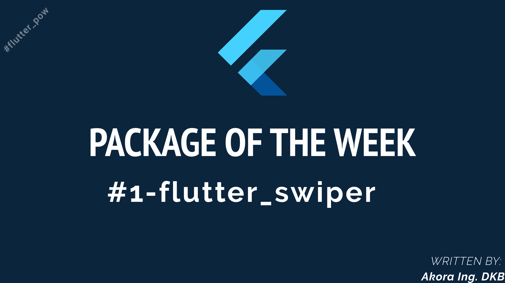
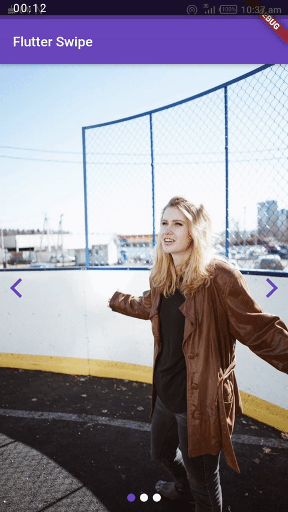

    

The first installment in the Package of the Week series. 
The [flutter_swiper](https://pub.dev/packages/flutter_swiper) package was made [JZoom](https://github.com/jzoom).  

Checkout the animated video on the package made by the [Colombo Flutter Community](https://twitter.com/fluttercmb) .  

### Screenshots

<table>
    <tr>
        <td></td>
        </td></td>
    </tr>
    <tr>
        <td></td>
        <td></td>
    </tr>
</table>

Made with :heart_eyes: by [Akora-IngDKB](https://github.com/Akora-IngDKB).  
Please show some :heart: by giving this repo as :star: as I will be updating it with time.  

If you found this helpful, please follow me on [Twitter](https://twitter.com/AkoraIng_DKB) and [Medium](https://medium.com/@debrahkwesibuabeng2) for more.

## Getting Started with Flutter

A few resources to get you started if this is your first Flutter project:

- [Lab: Write your first Flutter app](https://flutter.dev/docs/get-started/codelab)
- [Cookbook: Useful Flutter samples](https://flutter.dev/docs/cookbook)

For help getting started with Flutter, view our
[online documentation](https://flutter.dev/docs), which offers tutorials,
samples, guidance on mobile development, and a full API reference.
